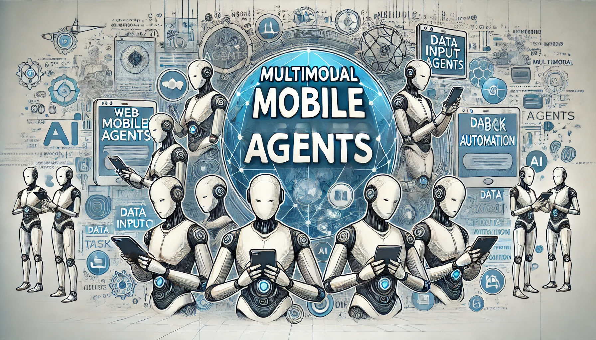

# AWESOME MOBILE AGENTS  
A COMPREHENSIVE SURVEY FOR VISION AND BEYOND

% Unimodal MOBILE AGENTS
% Multimodal MOBILE AGENTS 

## Base Model

- CogVLM: Visual Expert for Pretrained Language Models
- MiniCPM
- LLaVA-NeXT
- LLaVA-OneVision: Easy Visual Task Transfer
- SeeClick: Harnessing GUI Grounding for Advanced Visual GUI Agents (ACL2024)

## Prompt Based Framework

- AppAgent: Multimodal Agents as Smartphone Users
- Mobile-Agent: Autonomous Multi-Modal Mobile Device Agent with Visual Perception
- UFO: A UI-Focused Agent for Windows OS Interaction
- OS-Copilot: Towards Generalist Computer Agents with Self-Improvement
- MMAC-Copilot: Multi-modal Agent Collaboration Operating System Copilot

## LLM-SFT Based Framework
- CogAgent: A Visual Language Model for GUI Agents
- ScreenAI: A Vision-Language Model for UI and Infographics Understanding
- TRAINING A VISION LANGUAGE MODEL AS SMARTPHONE ASSISTANT (ICLR 2024)
- AGENTOHANA: Designing a Unified Data and Training Pipeline for Effective Agent Learning

## LLM-RL Based Framework

- Vision-Language Models as Decision-Making Agents
- DigiRL: Training In-The-Wild Device-Control Agents with Autonomous Reinforcement (NIPS2024)

## GUI Tools

- UIED: a hybrid tool for GUI element detection
- Object Detection for Graphical User Interface: Old Fashioned or Deep Learning or a Combination?

## Dataset

### 2017
- Scaling Instructable Agents Across Many Simulated Worlds (2017)

### 2022
- MiniWoB++ / Success Rate (2022)

### 2023
- MoTIF: A Dataset for Interactive Vision-Language Navigation with Unknown Command Feasibility (2023)
- IND2WEB: Towards a Generalist Agent for the Web (2023)
- WebArena: A Realistic Web Environment for Building Autonomous Agents (2023)

 
### 2024
- Android in the Wild: A Large-Scale Dataset for Android Device Control (2024)
- ANDROIDWORLD / Success Rate
- OSWORLD: Benchmarking Multimodal Agents for Open-Ended Tasks in Real Computer Environments / Success Rate
- Screen Agent (ACL2024)
- OmniACT: A Dataset and Benchmark for Enabling Multimodal Generalist Autonomous Agents for Desktop and Web / Sequence score
- Ferret-UI: Grounded Mobile UI Understanding with Multimodal LLMs
- AutoUI: You Only Look at Screens: Multimodal Chain-of-Action Agents (ACL2024)
- GUI-WORLD: A Dataset for GUI-oriented Multimodal LLM-based Agents

- Octo-planner: On-device Language Model for Planner-Action Agents
- AppWorld: A Controllable World of Apps and People for Benchmarking Interactive Coding Agents (ACL2024)
- Mobile-Bench: An Evaluation Benchmark for LLM-based Mobile Agents (ACL2024)
- VisualWebArena: Evaluating Multimodal Agents on Realistic Visually Grounded Web Tasks (ACL2024)
- WebCanvas: Benchmarking Web Agents in Online Environments
- MobileAgentBench: An Efficient and User-Friendly Benchmark for Mobile LLM Agents
- GUICourse: From General Vision Language Model to Versatile GUI Agent
- CoCo-Agent: A Comprehensive Cognitive MLLM Agent for Smartphone GUI Automation

  

## To-Do List
- WebVoyager: Building an End-to-End Web Agent with Large Multimodal Models (ACL2024)
- Tuning Large Multimodal Models for Videos using Reinforcement Learning from AI Feedback (ACL2024)

